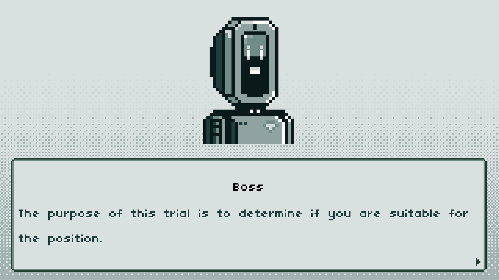
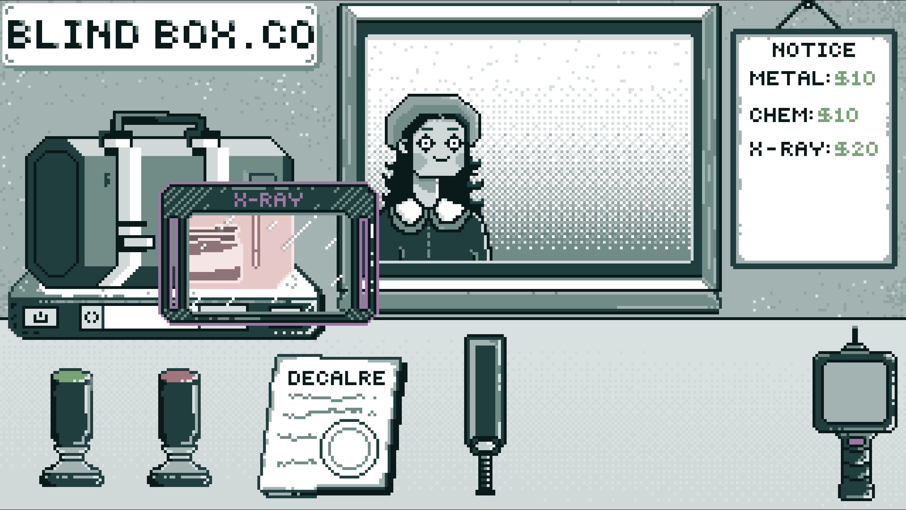
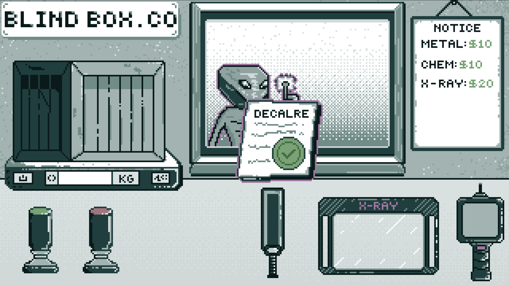
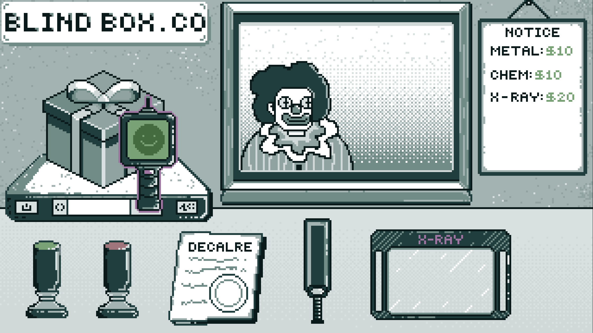

# Godot Wild Jam 82

## Overview
Blind Box.Co was made using Godot 4.4.1 and GDScript for the [Godot Wild Jam 82](https://itch.io/jam/godot-wild-jam-82). The theme of the game jam was was `UNSEEN`. We also included the  following wildcard:
- `Report Card`: Grade something the player does.

Blind Box.Co is a puzzle simulation game. You work at a postage service that has a strict no-package opening policy. Consequently, you must use your wits and various detectors to determine if customers are attempting to smuggle contraband. 

## Controls

The game is fully controlled using the mouse. 

- **Stamps**: Click and drag over document to sign.

- **Document**: Click and drag to character to submit.

- **Metal Detector**: Click and drag over the package. Beeps once metal is detected.

- **X-Ray**: Click and drag over the package. Reveals package contents.

- **Chemical Detecto**r. Click and drag over the package. Loads and shows result.

## Images
  
  
  
  

## Dependencies

The only dependency is the [Godot 4 game engine](https://godotengine.org/). 

## Setup the Project Locally

To setup the project locally, simply clone the repository and open the project in Godot. 

## Inspiration
- [Papers, Please](https://store.steampowered.com/app/239030/Papers_Please/)
- [Nocturne](https://sunspoken.itch.io/nocturne )
- [Border Patrol](https://store.steampowered.com/app/3134670/Border_Patrol/)
- [Sheriff of Nottingham](https://www.gamesworld.com.au/product/sheriff-of-nottingham-2nd-edition/)

## Asset References
- **DuffsDevice**. Game font. Retrieved from: https://www.pentacom.jp/pentacom/bitfontmaker2/gallery/?id=468
- **Jay_You**. Elevator music. Licence: Attribution 4.0. Retrieved from: https://freesound.org/people/Jay_You/sounds/467240/ 
- **wobesound**. Click SFX. Licence: Creative Commons 0. Retrieved from: https://freesound.org/people/wobesound/sounds/488381/
- **kermite607**. Stamp SFX. Licence: Creative Commons 0. Retrieved from: https://freesound.org/people/kermite607/sounds/362622/
- **vestibule-door**. Metal detector SFX. Licence: Creative Commons 0. Retrieved from: https://freesound.org/people/vestibule-door/sounds/668984/
- **IanStarGem**. Power on SFX. Licence: Creative Commons 0. Retrieved from: https://freesound.org/people/IanStarGem/sounds/278205/
- **LilMati**. Dialogue 1 SFX. Licence: Creative Commons 0. Retrieved from: https://freesound.org/people/LilMati/sounds/453037/
- **LilMati**. Dialogue 2 SFX. Licence: Creative Commons 0. Retrieved from: https://freesound.org/people/LilMati/sounds/453060/
- **LilMati**. Dialogue 3 SFX. Licence: Creative Commons 0. Retrieved from: https://freesound.org/people/LilMati/sounds/453087/
- **LilMati**. Dialogue 4 SFX. Licence: Creative Commons 0. Retrieved from: https://freesound.org/people/LilMati/sounds/453037/
- **LilMati**. Dialogue 5 SFX. Licence: Creative Commons 0. Retrieved from: https://freesound.org/people/LilMati/sounds/453085/
- **F.M.Audio**. Crunch paper SFX. Licence: Attribution 4.0. Retrieved from: https://freesound.org/people/F.M.Audio/sounds/561733/
- **pytho0n11**. Scan SFX. Licence: Creative Commons 0. Retrieved from: https://freesound.org/people/pyth0n11/sounds/706447/
- **AceOfSpadesP...**. Loading SFX. Licence: Attribution 4.0. Retrieved from: https://freesound.org/people/AceOfSpadesProduc100/sounds/340959/
- **unadamlar**. Correct SFX. Licence: Creative Commons 0. Retrieved from: https://freesound.org/people/unadamlar/sounds/476178/
- **BaggoNotes**. Incorrect SFX. Licence: Creative Commons 0. Retrieved from: https://freesound.org/people/BaggoNotes/sounds/720893/
- **PeterBluewin**. Morning SFX. Licence: Attribution 4.0. Retrieved from: https://freesound.org/people/PeterBluewin/sounds/728551/?
- **maxmakessounds**. Victory SFX. Licence: Attribution 4.0. Retrieved from: https://freesound.org/people/maxmakessounds/sounds/353546/
- **Leszek_Szary**. Failure SFX. Licence: Creative Commons 0. Retrieved from: https://freesound.org/people/Leszek_Szary/sounds/171672/

## Code References
- **Jon Topielski**. Text box. Retrieved from: https://www.youtube.com/watch?v=QEHOiORnXIk 
- **Soma Animus**. Global audio player. Retrieved from: https://www.youtube.com/watch?v=lILnUD3xph8
- **golddotasksquestions**. 2D Mask. Retrieved from: https://github.com/godotengine/godot-proposals/issues/4282#issuecomment-1098859866
